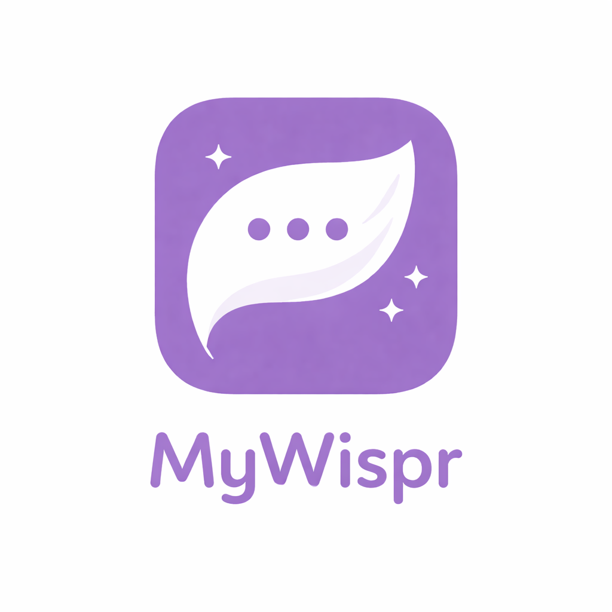

# MyWispr

A lightweight macOS menu bar app that transcribes your voice and instantly types the result into whatever app you're using — no switching windows, no copy-pasting.



[](https://github.com/abennat-cyber/MyWispr/releases/download/v0.4.5/MyWispr-0.4.5.dmg)
[](https://github.com/abennat-cyber/MyWispr/releases/latest)

---

## Download

**[MyWispr-0.4.5.dmg](https://github.com/abennat-cyber/MyWispr/releases/download/v0.4.5/MyWispr-0.4.5.dmg)** — macOS 14+ · Apple Silicon

1. Open the DMG
2. Drag **MyWispr.app** to your **Applications** folder
3. Right-click the app → **Open** (required on first launch because the app is not notarized)

---

## Features

- **Global hotkey** — press a configurable shortcut from any app to start recording
- **Two recording modes** — *Toggle* (press once to start, again to stop) or *Hold to Talk* (hold to record, release to transcribe)
- **Three transcription engines**
  - **Local Whisper** (whisper.cpp) — fully offline, runs on your Mac
  - **OpenAI Whisper API** — cloud-based, higher accuracy
  - **Custom command** — bring your own shell command via a `{audio_path}` template
- **Auto-inserts text** — types directly into the focused app, with clipboard fallback
- **Multi-language support** — pick up to 5 languages or use auto-detect
- **Custom vocabulary** — teach Whisper your names, acronyms, and domain terms
- **Meeting recorder** — records system + mic audio for a full meeting, then saves a transcript as a `.txt` file and reveals it in Finder
- **Recording retention** — delete after transcription, keep for N days, or keep forever
- **Settings stored securely** — preferences in `UserDefaults`, API key in the system Keychain

---

## Requirements

| Requirement | Version |
|---|---|
| macOS | 14 Sonoma or later |
| Swift | 6.0+ |
| Xcode / Swift Package Manager | any recent release |
| whisper.cpp binary | required for Local Whisper engine |
| OpenAI API key | required for Whisper API engine |

---

## Build & Run

Clone the repository and build with Swift Package Manager:

```bash
git clone https://github.com/abennat-cyber/MyWispr.git
cd MyWispr
swift build -c release
```

Then run the compiled binary:

```bash
.build/release/MyWispr
```

Or open the folder in Xcode and press **Run**.

---

## Setting Up the Local Whisper Engine

1. Install [whisper.cpp](https://github.com/ggerganov/whisper.cpp) and build the `whisper-cli` binary.
2. Download a model (e.g. `base` or `medium`):

```bash
# from the whisper.cpp repo
bash models/download-ggml-model.sh base
```

3. Open **MyWispr → Settings → Engine** and select **Local Whisper**.
4. Point the model directory to where your `ggml-*.bin` files live (default: `~/.local/share/whisper/models`).

The onboarding screen guides you through this automatically on first launch.

---

## Setting Up the OpenAI Whisper API Engine

1. Open **Settings → Engine** and select **OpenAI Whisper API**.
2. Paste your [OpenAI API key](https://platform.openai.com/api-keys) — it is stored in the macOS Keychain, never on disk.

---

## Custom Command Engine

Set any shell command as the transcription engine. Use `{audio_path}` as a placeholder for the recorded audio file:

```
whisper-cli --model medium {audio_path} --output-txt --stdout
```

The command runs inside a login `zsh` shell so your `PATH` and shell configuration are respected.

---

## Permissions

MyWispr requests the following macOS permissions:

| Permission | Purpose |
|---|---|
| **Microphone** | Capture audio for dictation |
| **Accessibility** | Type transcribed text into the active app |
| **Screen Recording** | Capture system audio for meeting recording |

---

## Project Structure

```
MyWispr/
├── Package.swift               # Swift Package manifest
├── Sources/MyWispr/
│   ├── MyWisprApp.swift        # App entry point & menu bar setup
│   ├── AppModel.swift          # Core state machine (record → transcribe → insert)
│   ├── Models.swift            # All data types and settings schema
│   ├── SettingsStore.swift     # Persistent settings + Keychain API key storage
│   ├── AudioRecorder.swift     # Microphone capture (AVFoundation)
│   ├── AudioSilenceDetector.swift # Analyzes audio for silence/speech presence
│   ├── MeetingRecorder.swift   # System + mic capture (ScreenCaptureKit)
│   ├── LocalCalendarService.swift # Reads calendar events for auto-filling titles
│   ├── TranscriptionService.swift  # Routes to the active engine
│   ├── LocalWhisperService.swift   # whisper.cpp integration
│   ├── WhisperAPIService.swift     # OpenAI Whisper API integration
│   ├── InputInserter.swift     # Types / pastes / copies transcribed text
│   ├── HotkeyManager.swift     # Global hotkey registration (Carbon)
│   ├── KeychainStore.swift     # Keychain read/write helpers
│   ├── MenuBarView.swift       # Menu bar popover UI
│   ├── SettingsView.swift      # Settings window UI
│   ├── OnboardingView.swift    # First-run setup wizard
│   ├── ShortcutRecorder.swift  # Hotkey capture UI component
│   ├── LanguagePickerView.swift
│   ├── WhisperLanguage.swift
│   └── ProcessRunner.swift
└── Sources/MyWisprCore/        # Core helper models and business rules
    ├── DictationOptimizationSupport.swift # Dictation/latency configurations
    ├── MeetingArtifacts.swift  # Model and schema representation for meetings
    ├── MeetingAutofillSupport.swift # Logic for auto-populating meeting info
    ├── MeetingLiveTranscriptionSupport.swift # Live segment processing
    ├── TranscriptPostProcessing.swift # Custom filters (e.g. silence hallucinations)
    └── TranscriptionLanguageSupport.swift # Language mappings and detection details
```

---

## Releases & Changelog

- **v0.4.5** — Release v0.4.5.
- **v0.4.5** — Add setting to mute system speaker volume output during dictation recording.
- **v0.4.3** — Avoid launch-time SwiftUI windows (improving startup performance and menu-bar only behavior).
- **v0.4.2** — Remove AppKit display-cycle window mutations (cleaner window management lifecycle).
- **v0.4.1** — Fix settings window layout crash.
- **v0.4.0** — Initial open-source release of MyWispr. Features include local/cloud Whisper support, custom shell command transcription engine, meeting recording (mic + system audio via ScreenCaptureKit), calendar auto-fill, custom vocabulary, and secure Settings storage.

---

## License

MIT — see [LICENSE](LICENSE) for details.
